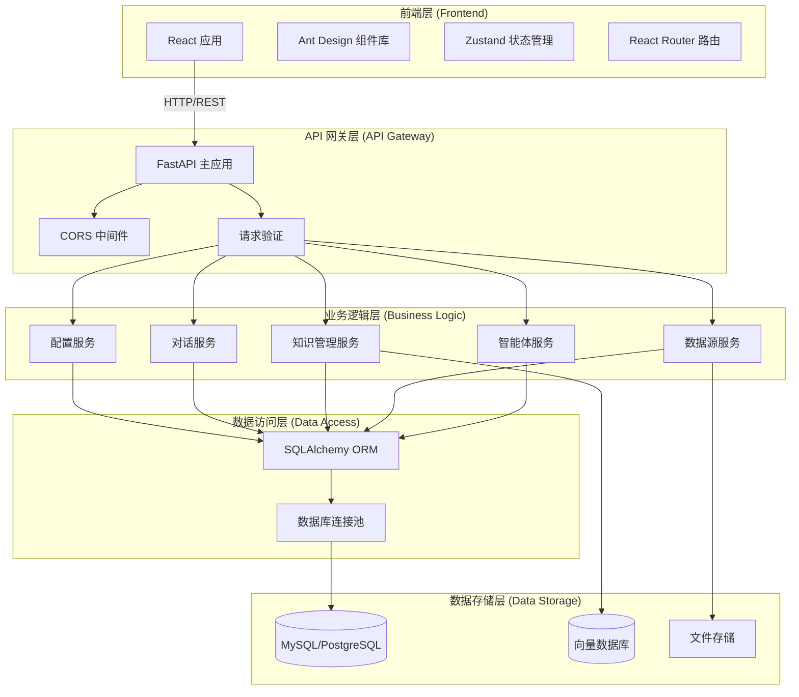
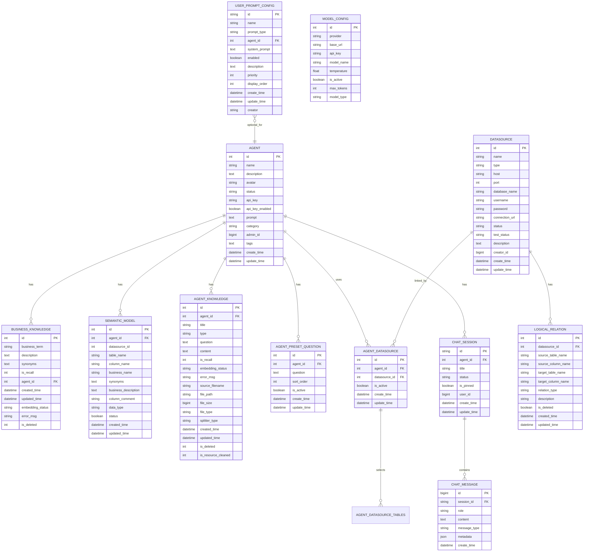
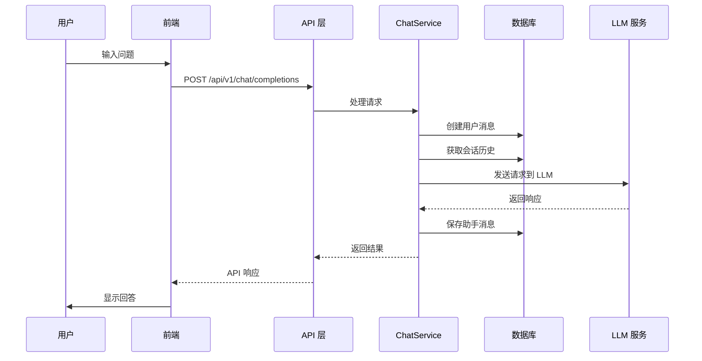
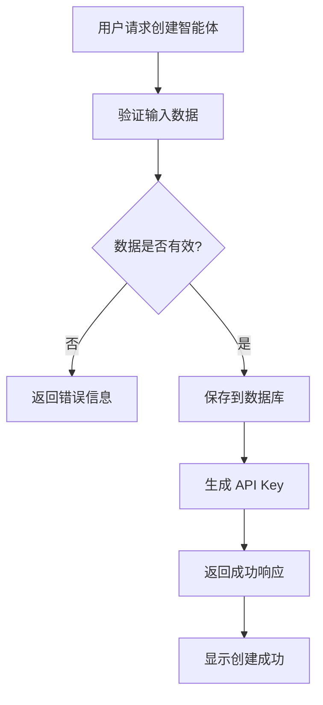
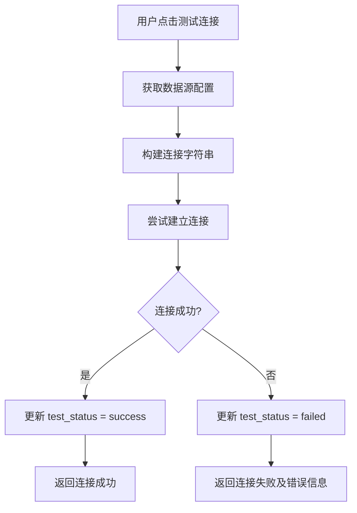
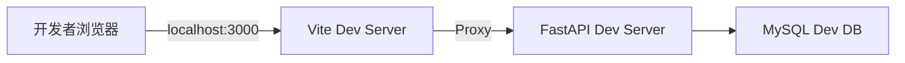
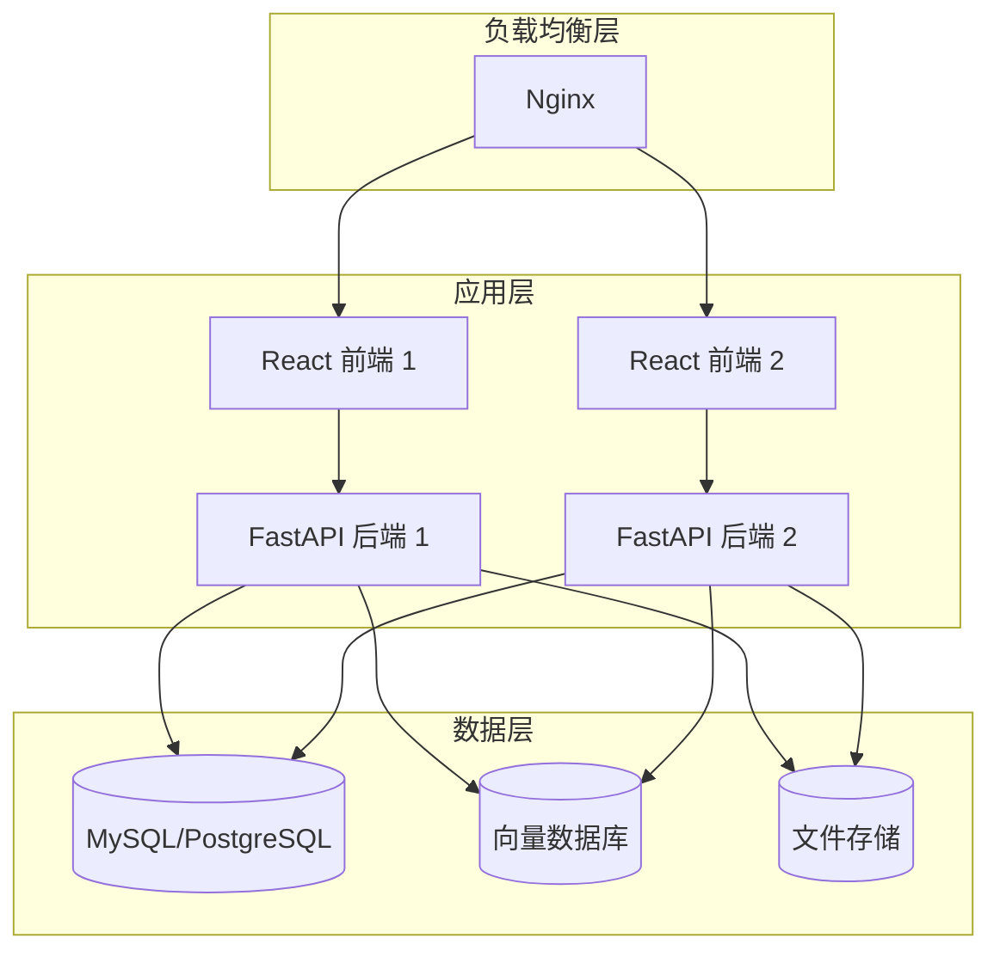

# Data Agent 架构文档

## 1. 系统架构

### 1.1 整体架构图



### 1.2 分层架构说明

| 层级 | 技术选型 | 职责 |
|------|---------|------|
| 前端层 | React + Ant Design | 用户界面、交互逻辑、状态管理 |
| API 网关层 | FastAPI | 路由分发、请求验证、CORS、文档生成 |
| 业务逻辑层 | Python 服务 | 核心业务逻辑、工作流编排 |
| 数据访问层 | SQLAlchemy | ORM 映射、数据查询、事务管理 |
| 数据存储层 | MySQL/PostgreSQL | 结构化数据存储、业务数据持久化 |

---

## 2. 目录结构

```
data_agent_refactored/
├── backend/
│   ├── app/
│   │   ├── __init__.py
│   │   ├── main.py                 # 应用入口
│   │   ├── api/
│   │   │   └── v1/
│   │   │       ├── __init__.py
│   │   │       └── routers/
│   │   │           ├── agent.py       # 智能体路由
│   │   │           ├── datasource.py  # 数据源路由
│   │   │           ├── knowledge.py   # 知识管理路由
│   │   │           └── chat.py        # 对话路由
│   │   ├── core/
│   │   │   ├── config.py           # 配置管理
│   │   │   └── database.py         # 数据库连接
│   │   ├── models/
│   │   │   ├── __init__.py
│   │   │   ├── agent.py            # 智能体模型
│   │   │   ├── datasource.py       # 数据源模型
│   │   │   ├── knowledge.py        # 知识模型
│   │   │   └── chat.py             # 对话模型
│   │   ├── schemas/
│   │   │   ├── __init__.py
│   │   │   ├── agent.py
│   │   │   ├── datasource.py
│   │   │   ├── knowledge.py
│   │   │   ├── chat.py
│   │   │   └── common.py
│   │   └── services/
│   │       ├── __init__.py
│   │       ├── crud_base.py        # 基础 CRUD
│   │       ├── agent_service.py
│   │       ├── datasource_service.py
│   │       ├── knowledge_service.py
│   │       └── chat_service.py
│   ├── tests/
│   ├── requirements.txt
│   └── .env.example
│
└── frontend/
    ├── src/
    │   ├── main.jsx
    │   ├── App.jsx
    │   ├── index.css
    │   ├── components/
    │   │   └── AppLayout.jsx
    │   ├── pages/
    │   │   ├── Dashboard.jsx
    │   │   ├── Agents.jsx
    │   │   ├── AgentDetail.jsx
    │   │   ├── Chat.jsx
    │   │   └── Settings.jsx
    │   ├── services/
    │   │   ├── api.js
    │   │   └── index.js
    │   └── store/
    │       └── appStore.js
    ├── package.json
    ├── vite.config.js
    └── index.html
```

---

## 3. 数据模型设计

### 3.1 实体关系图 (ERD)



### 3.2 核心表说明

#### 3.2.1 智能体表 (agent)

| 字段 | 类型 | 说明 |
|------|------|------|
| id | INT | 主键，自增 |
| name | VARCHAR(255) | 智能体名称 |
| description | TEXT | 描述 |
| avatar | TEXT | 头像 URL |
| status | VARCHAR(50) | 状态：draft/published/offline |
| api_key | VARCHAR(255) | API Key |
| api_key_enabled | BOOLEAN | API Key 是否启用 |
| prompt | TEXT | 自定义 Prompt |
| category | VARCHAR(100) | 分类 |
| tags | TEXT | 标签，逗号分隔 |
| create_time | DATETIME | 创建时间 |
| update_time | DATETIME | 更新时间 |

#### 3.2.2 数据源表 (datasource)

| 字段 | 类型 | 说明 |
|------|------|------|
| id | INT | 主键，自增 |
| name | VARCHAR(255) | 数据源名称 |
| type | VARCHAR(50) | 类型：mysql/postgresql |
| host | VARCHAR(255) | 主机地址 |
| port | INT | 端口 |
| database_name | VARCHAR(255) | 数据库名 |
| username | VARCHAR(255) | 用户名 |
| password | VARCHAR(255) | 密码（加密存储） |
| connection_url | VARCHAR(1000) | 完整连接 URL |
| status | VARCHAR(50) | 状态：active/inactive |
| test_status | VARCHAR(50) | 连接测试状态 |

#### 3.2.3 对话会话表 (chat_session)

| 字段 | 类型 | 说明 |
|------|------|------|
| id | VARCHAR(36) | 主键，UUID |
| agent_id | INT | 智能体 ID，外键 |
| title | VARCHAR(255) | 会话标题 |
| status | VARCHAR(50) | 状态：active/archived/deleted |
| is_pinned | BOOLEAN | 是否置顶 |
| user_id | BIGINT | 用户 ID |
| create_time | DATETIME | 创建时间 |
| update_time | DATETIME | 更新时间 |

#### 3.2.4 对话消息表 (chat_message)

| 字段 | 类型 | 说明 |
|------|------|------|
| id | BIGINT | 主键，自增 |
| session_id | VARCHAR(36) | 会话 ID，外键 |
| role | VARCHAR(20) | 角色：user/assistant/system |
| content | TEXT | 消息内容 |
| message_type | VARCHAR(50) | 类型：text/sql/result/error |
| metadata | JSON | 元数据 |
| create_time | DATETIME | 创建时间 |

---

## 4. 核心业务流程

### 4.1 对话问答流程



### 4.2 智能体创建流程



### 4.3 数据源测试连接流程



---

## 5. API 设计规范

### 5.1 响应格式

#### 成功响应
```json
{
  "code": 200,
  "message": "success",
  "data": {
    // 业务数据
  }
}
```

#### 分页响应
```json
{
  "code": 200,
  "message": "success",
  "data": {
    "items": [],
    "total": 100,
    "page": 1,
    "page_size": 20,
    "total_pages": 5
  }
}
```

### 5.2 API 端点列表

| 模块 | 方法 | 路径 | 说明 |
|------|------|------|------|
| 智能体 | GET | /api/v1/agents | 获取智能体列表 |
| 智能体 | GET | /api/v1/agents/{id} | 获取智能体详情 |
| 智能体 | POST | /api/v1/agents | 创建智能体 |
| 智能体 | PUT | /api/v1/agents/{id} | 更新智能体 |
| 智能体 | DELETE | /api/v1/agents/{id} | 删除智能体 |
| 数据源 | GET | /api/v1/datasources | 获取数据源列表 |
| 数据源 | POST | /api/v1/datasources | 创建数据源 |
| 对话 | POST | /api/v1/chat/completions | 发送对话消息 |
| 对话 | GET | /api/v1/chat/sessions | 获取会话列表 |
| 对话 | GET | /api/v1/chat/sessions/{id}/messages | 获取会话消息 |

### 5.3 状态码

| 状态码 | 说明 |
|--------|------|
| 200 | 成功 |
| 201 | 创建成功 |
| 400 | 请求参数错误 |
| 401 | 未授权 |
| 404 | 资源不存在 |
| 500 | 服务器内部错误 |

---

## 6. 部署架构

### 6.1 开发环境部署



### 6.2 生产环境部署



---

## 7. 配置说明

### 7.1 环境变量配置

| 变量名 | 说明 | 默认值 |
|--------|------|--------|
| DATABASE_URL | 数据库连接字符串 | mysql+pymysql://... |
| APP_NAME | 应用名称 | Data Agent |
| DEBUG | 调试模式 | True |
| BACKEND_CORS_ORIGINS | CORS 源 | ["http://localhost:3000"] |
| UPLOAD_DIR | 文件上传目录 | ./uploads |
| MAX_UPLOAD_SIZE | 最大上传大小 | 52428800 |

### 7.2 前端配置

```javascript
// vite.config.js
export default {
  server: {
    port: 3000,
    proxy: {
      '/api': {
        target: 'http://localhost:8000',
        changeOrigin: true
      }
    }
  }
}
```

---

## 8. 技术选型理由

### 8.1 后端技术选型

| 技术 | 理由 |
|------|------|
| FastAPI | 高性能、异步支持、自动 API 文档、类型提示 |
| SQLAlchemy | 成熟的 ORM，支持多种数据库 |
| Pydantic | 强大的数据验证和序列化 |
| Uvicorn | ASGI 服务器，性能优秀 |

### 8.2 前端技术选型

| 技术 | 理由 |
|------|------|
| React 18 | 生态丰富，组件化开发 |
| Vite | 快速的开发体验，构建速度快 |
| Ant Design | 企业级 UI 组件库，功能完善 |
| Zustand | 轻量级状态管理，API 简洁 |
| React Router | 官方路由库，功能完善 |

---

## 9. 扩展建议

### 9.1 功能扩展
- [ ] 添加用户认证和授权
- [ ] 实现 WebSocket 流式响应
- [ ] 添加向量数据库集成
- [ ] 实现 Python 代码执行环境
- [ ] 添加 MCP 服务器支持

### 9.2 性能优化
- [ ] 添加 Redis 缓存
- [ ] 实现数据库读写分离
- [ ] 添加 API 限流
- [ ] 实现异步任务处理

### 9.3 运维优化
- [ ] 添加 Docker 支持
- [ ] 添加日志收集
- [ ] 添加监控指标
- [ ] 实现 CI/CD 流水线
